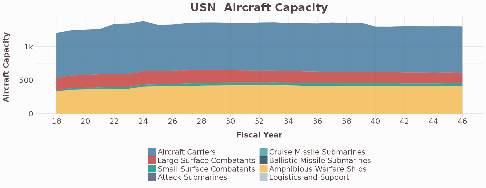

# Build your own Navy (by ship class)

  <b></b> 
  <a href="http://analytics.csis.org/navy-/">app</a> 
[Link to app on analytics.csis.org](http://analytics.csis.org/navy-/)
 
We designed this app to give our users the ability to build their own Navy force structure. In seconds, you can see the impact of the Navy's plan, as well as the impact of thousands of different plans. The app allows you to build more ships, retire existing ships, develop new ships, and change the build rate. And this goes far beyond the number of ships. We've included acquisition cost, operations and support costs, personnel numbers, aircraft capacity, and much more.  

The Navy faces the challenge of how to allocate resources between operating existing fleets, maintaining shipyard production lines, and developing new capabilities. These decisions involve many stakeholders, including leaders within Congress, the White House, industry, and the Department of Defense. 

Unlike in many private sector industries, stakeholders in the public sector do not share access to tools that make it easy to understand and plan for investments. While key stakeholders can hold different and sometimes competing perspectives, there are many areas of common ground. But progress requires more than a shared vision. It also relies on developing a better understanding of our current plans and the potential impact of new investments. 

The impact of potential government investments is generally evaluated in terms of financial costs. And the list of investment options that get evaluated is quite short, limited mainly to legislative proposals or agency recommendations.
We rely primarily on the Congressional Budget Office for these types of assessments, who's role is to provide independent analysis of the budgetary and economic impact that public polices may have. 

Navy shipbuilding, a major military program that requires substantial planning and massive investments, is one of the key areas that CBO examines. When the Navy releases its annual thirty-year shipbuilding plan, the CBO estimates the financial costs of the plan. The final CBO report provides a helpful resource for Congress and the public to understand the Navy's intentions and to evaluate its budgetary implications. But why stop there? 

First, we should more comprehensively evaluate government investments to include other factors such as personnel requirements, the impact on jobs, and the implications on capacity or capabilities. Second, we should have the ability to evaluate a longer list of investment options and to compare those plans against each other. This app is designed to do just that for Navy ships, but it is only a small step in that direction. 

Our sources include: the U.S. Navy, Congressional Budget Office, Government Accountability Office, Naval Graphics, Naval Vessel Register, Office of Management and Budget, and Selected Acquisition Reports. 

